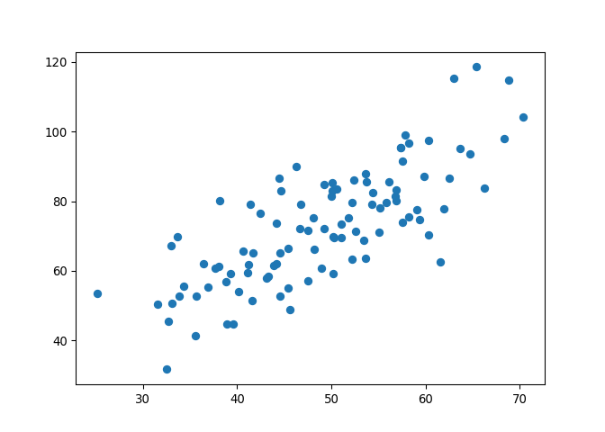
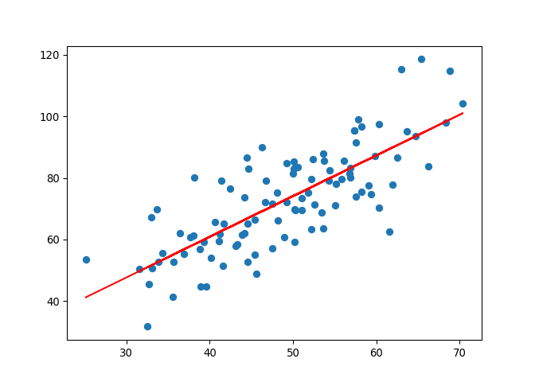

Linear Regression
================
Haolin Zhong (UNI: hz2771)
2021/10/1

# Unary Linear Regression: Core ideas

-   Find
     = wx_i + b"),
    making
     \simeq y_i")

-   Least square method:
     = arg\space min _{(w, b)} \sum_{i=1}^{m} (f(x_i) - y_i)^2")

-   Loss function:
     = \displaystyle \sum_{i=1}^{m} (f(x_i) - y_i)^2")

-   When
    }{\partial w} = 0"),
    }{\partial b} = 0"),
    min loss achieved. (the derivatives are monotonically increasing)

    -   }{\sum_{i=1}^{m} x_{i}^{2}-\frac{1}{m}\left(\sum_{i=1}^{m} x_{i}\right)^{2}}")
    -   ")

# Practice

``` python
import numpy as np
import matplotlib.pyplot as plt
```

## Import data

``` python
points = np.genfromtxt("../Data/data.csv", delimiter=',')

X = points[:, 0]
Y = points[:, 1]

plt.scatter(X,Y)
plt.show()
```



## Define cost function

``` python
def compute_cost(w, b, points):
    X = points[:, 0]
    Y = points[:, 1]
    
    costs = (Y - w * X - b) ** 2
    
    return np.mean(costs)
```

## Define fit function

``` python
def fit(points):
    X = points[:, 0]
    Y = points[:, 1]
    N = len(points)
    
    YX = np.sum(Y * (X - np.mean(X)))
    X2 = np.sum(X**2)
    
    w = YX / (X2 - N*(np.mean(X)**2))
    
    b = np.mean(Y - w*X)
    
    return w, b
```

## Test

``` python
w, b = fit(points)

print("w is " + str(w) + ", " + "b is " + str(b))
```

    ## w is 1.32243102275536, b is 7.9910209822703795

``` python
print("cost is " + str(compute_cost(w, b, points)))
```

    ## cost is 110.25738346621316

## Visualize the fit line

``` python
pred_Y = w * X + b

plt.close()
plt.scatter(X, Y)
plt.plot(X, pred_Y, c = 'r')
plt.show()
```



# Solving Multiple Linear Regression by Gradient Descent

-   =X^{T} \theta=\sum_{k=0}^{n} \theta_{k} x_{k}")
-   =\frac{1}{m} \sum_{i=1}^{m}\left(h_{\theta}\left(x^{(i)}\right)-y^{(i)}\right)^{2}")
-   }{\partial \theta_n}")
-   ![\\begin{aligned} \\frac{\\partial J(\\theta)}{\\partial \\theta\_{j}} &=\\frac{\\partial}{\\partial \\theta\_{j}} \\frac{1}{m} \\sum\_{i=1}\\left(h\_{\\theta}\\left(x^{(i)}\\right)-y^{(i)}\\right)^{2} \\\\ &=2 \\cdot \\frac{1}{m} \\sum\_{i=1}^{m}\\left(h\_{\\theta}\\left(x^{(i)}\\right)-y^{(i)}\\right) \\cdot \\frac{\\partial}{\\partial \\theta\_{j}}\\left(h\_{\\theta}\\left(x^{(i)}\\right)-y^{(i)}\\right) \\\\ &=\\frac{2}{m} \\sum\_{i=1}^{m}\\left(h\_{\\theta}\\left(x^{(i)}\\right)-y^{(i)}\\right) \\cdot \\frac{\\partial}{\\partial \\theta\_{j}}\\left(\\sum\_{k=0}^{n} \\theta\_{k} x\_{k}^{(i)}-y^{(i)}\\right) \\\\ &=\\frac{2}{m} \\sum\_{i=1}^{m}\\left(h\_{\\theta}\\left(x^{(i)}\\right)-y^{(i)}\\right) \\cdot x\_{j}^{(i)} \\end{aligned}](https://latex.codecogs.com/png.latex?%5Cbegin%7Baligned%7D%20%5Cfrac%7B%5Cpartial%20J%28%5Ctheta%29%7D%7B%5Cpartial%20%5Ctheta_%7Bj%7D%7D%20%26%3D%5Cfrac%7B%5Cpartial%7D%7B%5Cpartial%20%5Ctheta_%7Bj%7D%7D%20%5Cfrac%7B1%7D%7Bm%7D%20%5Csum_%7Bi%3D1%7D%5Cleft%28h_%7B%5Ctheta%7D%5Cleft%28x%5E%7B%28i%29%7D%5Cright%29-y%5E%7B%28i%29%7D%5Cright%29%5E%7B2%7D%20%5C%5C%20%26%3D2%20%5Ccdot%20%5Cfrac%7B1%7D%7Bm%7D%20%5Csum_%7Bi%3D1%7D%5E%7Bm%7D%5Cleft%28h_%7B%5Ctheta%7D%5Cleft%28x%5E%7B%28i%29%7D%5Cright%29-y%5E%7B%28i%29%7D%5Cright%29%20%5Ccdot%20%5Cfrac%7B%5Cpartial%7D%7B%5Cpartial%20%5Ctheta_%7Bj%7D%7D%5Cleft%28h_%7B%5Ctheta%7D%5Cleft%28x%5E%7B%28i%29%7D%5Cright%29-y%5E%7B%28i%29%7D%5Cright%29%20%5C%5C%20%26%3D%5Cfrac%7B2%7D%7Bm%7D%20%5Csum_%7Bi%3D1%7D%5E%7Bm%7D%5Cleft%28h_%7B%5Ctheta%7D%5Cleft%28x%5E%7B%28i%29%7D%5Cright%29-y%5E%7B%28i%29%7D%5Cright%29%20%5Ccdot%20%5Cfrac%7B%5Cpartial%7D%7B%5Cpartial%20%5Ctheta_%7Bj%7D%7D%5Cleft%28%5Csum_%7Bk%3D0%7D%5E%7Bn%7D%20%5Ctheta_%7Bk%7D%20x_%7Bk%7D%5E%7B%28i%29%7D-y%5E%7B%28i%29%7D%5Cright%29%20%5C%5C%20%26%3D%5Cfrac%7B2%7D%7Bm%7D%20%5Csum_%7Bi%3D1%7D%5E%7Bm%7D%5Cleft%28h_%7B%5Ctheta%7D%5Cleft%28x%5E%7B%28i%29%7D%5Cright%29-y%5E%7B%28i%29%7D%5Cright%29%20%5Ccdot%20x_%7Bj%7D%5E%7B%28i%29%7D%20%5Cend%7Baligned%7D "\begin{aligned} \frac{\partial J(\theta)}{\partial \theta_{j}} &=\frac{\partial}{\partial \theta_{j}} \frac{1}{m} \sum_{i=1}\left(h_{\theta}\left(x^{(i)}\right)-y^{(i)}\right)^{2} \\ &=2 \cdot \frac{1}{m} \sum_{i=1}^{m}\left(h_{\theta}\left(x^{(i)}\right)-y^{(i)}\right) \cdot \frac{\partial}{\partial \theta_{j}}\left(h_{\theta}\left(x^{(i)}\right)-y^{(i)}\right) \\ &=\frac{2}{m} \sum_{i=1}^{m}\left(h_{\theta}\left(x^{(i)}\right)-y^{(i)}\right) \cdot \frac{\partial}{\partial \theta_{j}}\left(\sum_{k=0}^{n} \theta_{k} x_{k}^{(i)}-y^{(i)}\right) \\ &=\frac{2}{m} \sum_{i=1}^{m}\left(h_{\theta}\left(x^{(i)}\right)-y^{(i)}\right) \cdot x_{j}^{(i)} \end{aligned}")
