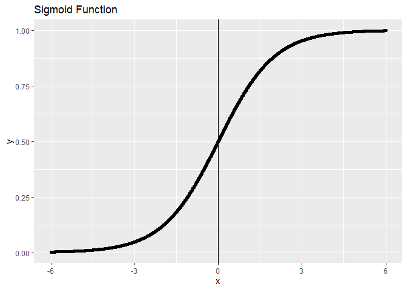

Logistic Regression
================
Haolin Zhong (UNI: hz2771)
2021/10/3

# Core ideas

-   Find a best curve as the boundary between target categories
-   sigmoid function:
    =\frac{1}{1+e^{-z}}");
    ");
    ")
    can be a high order fucntion

<!-- -->

-   Loss function:
    -   MSE: cannot guanranteed to be a convex function
    -   loss shouldn’t be defined as
         - Y"),
        because in such definition there is basically no difference
        being right or wrong nearing z = 0
    -   The idea cost function should drastically decrease nearing 0,
        then slowly decrease with abs(z) grows. A log function do meet
        this demand, and it is also able to simplify the exponential
        function
    -   , y\right)=\left\{\begin{aligned}-\log \left(h_{\theta}(x)\right) & \text { if } y=1 \\-\log \left(1-h_{\theta}(x)\right) & \text { if } y=0 \end{aligned}\right.")
    -   ![-\\frac{1}{m} \\sum\_{i=1}^{m}\\left\[y^{(i)} \\log h\_{\\theta}\\left(x^{(i)}\\right)+\\left(1-y^{(i)}\\right) \\log \\left(1-h\_{\\theta}\\left(x^{(i)}\\right)\\right)\\right\]](https://latex.codecogs.com/png.latex?-%5Cfrac%7B1%7D%7Bm%7D%20%5Csum_%7Bi%3D1%7D%5E%7Bm%7D%5Cleft%5By%5E%7B%28i%29%7D%20%5Clog%20h_%7B%5Ctheta%7D%5Cleft%28x%5E%7B%28i%29%7D%5Cright%29%2B%5Cleft%281-y%5E%7B%28i%29%7D%5Cright%29%20%5Clog%20%5Cleft%281-h_%7B%5Ctheta%7D%5Cleft%28x%5E%7B%28i%29%7D%5Cright%29%5Cright%29%5Cright%5D "-\frac{1}{m} \sum_{i=1}^{m}\left[y^{(i)} \log h_{\theta}\left(x^{(i)}\right)+\left(1-y^{(i)}\right) \log \left(1-h_{\theta}\left(x^{(i)}\right)\right)\right]")
    -   To get a convex function and avoid overfit, add a regularization
        term:
        ![J(\\theta)=-\\frac{1}{m} \\sum\_{i=1}^{m}\\left\[y^{(i)} \\log h\_{\\theta}\\left(x^{(i)}\\right)+\\left(1-y^{(i)}\\right) \\log \\left(1-h\_{\\theta}\\left(x^{(i)}\\right)\\right)\\right\]+\\frac{\\lambda}{2 m} \\sum\_{j=1}^{n} \\theta\_{j}^{2}](https://latex.codecogs.com/png.latex?J%28%5Ctheta%29%3D-%5Cfrac%7B1%7D%7Bm%7D%20%5Csum_%7Bi%3D1%7D%5E%7Bm%7D%5Cleft%5By%5E%7B%28i%29%7D%20%5Clog%20h_%7B%5Ctheta%7D%5Cleft%28x%5E%7B%28i%29%7D%5Cright%29%2B%5Cleft%281-y%5E%7B%28i%29%7D%5Cright%29%20%5Clog%20%5Cleft%281-h_%7B%5Ctheta%7D%5Cleft%28x%5E%7B%28i%29%7D%5Cright%29%5Cright%29%5Cright%5D%2B%5Cfrac%7B%5Clambda%7D%7B2%20m%7D%20%5Csum_%7Bj%3D1%7D%5E%7Bn%7D%20%5Ctheta_%7Bj%7D%5E%7B2%7D "J(\theta)=-\frac{1}{m} \sum_{i=1}^{m}\left[y^{(i)} \log h_{\theta}\left(x^{(i)}\right)+\left(1-y^{(i)}\right) \log \left(1-h_{\theta}\left(x^{(i)}\right)\right)\right]+\frac{\lambda}{2 m} \sum_{j=1}^{n} \theta_{j}^{2}")
-   Gradient descent:
    -   ")
    -   Omit calculating the deriatives.
